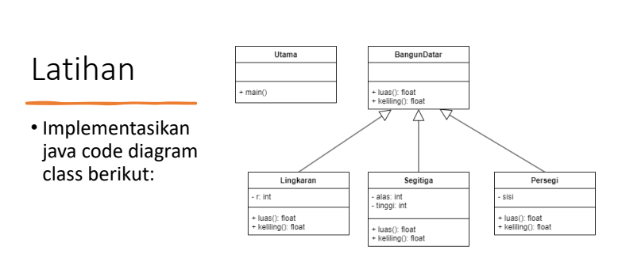

# Praktikum4


## class BangunDatar

```
abstract class BangunDatar {
    abstract float luas();
    abstract float keliling();

}

```

<p>* abstrak class bangun datar memiliki dua metode abstrak, yaitu luas dan keliling. konsep abstrak digunakan pada class bangun datar 
karena merupakan sebuah konsep abstrak dalam geometri yang mewakili bentuk-bentuk dua dimensi yang memiliki luas seperti lingkaran, segitiga, dan persegi.</p>

## class Lingkaran

```

public class Lingkaran extends BangunDatar {
    int r;

    public Lingkaran(int r) {
        this.r = r;
    }

    @Override
    float luas() {
        return (float) (Math.PI * r * r);
    }

    @Override
    float keliling() {
        return (float) (2 * Math.PI * r);
    }

}
```
## class segitiga

```

public class Segitiga extends BangunDatar {
    int alas, tinggi;

    public Segitiga(int alas, int tinggi) {
        this.alas = alas;
        this.tinggi = tinggi;
    }

    @Override
    float luas() {
        return (float) (0.5 * alas * tinggi);
    }

    @Override
    float keliling() {
        int sisiMiring = (int) Math.sqrt((alas * alas) + (tinggi * tinggi));
        return alas + tinggi + sisiMiring;
    }
  
}
```
## class persegi

```

public class Persegi extends BangunDatar {
    int sisi;

    public Persegi(int sisi) {
        this.sisi = sisi;
    }

    @Override
    float luas() {
        return sisi * sisi;
    }

    @Override
    float keliling() {
        return 4 * sisi;
    }
    
}
```
<p>* class lingkaran, segitiga, dan persegi adalah class turunan dari bangun datar yang mengimplementasikan metode luas dan keliling sesuai rumusnya masing-masing</p>
<p>* Lingkaran yang memiliki atribut jari-jari, segitiga memiliki atribut alas dan tinggi, dan persegi memiliki atribut sisi. </p>

## class main

```

package bangundatar;

public class Utama {
    public static void main(String[] args){
        // membuat object
        Lingkaran lingkaran = new Lingkaran(7);
        Segitiga segitiga = new Segitiga(5,3);
        Persegi persegi = new Persegi(8);
        
        // memanggil method
        System.out.println ("Lingkaran:");
        System.out.println("Luas lingkaran: " + lingkaran.luas());
        System.out.println("Keliling lingkaran: " + lingkaran.keliling());
        
        System.out.println("Segitiga:");
        System.out.println("Luas segitiga: " + segitiga.luas());
        System.out.println("Keliling segitiga: " + segitiga.keliling());
 // Perlu diubah jika diketahui sisi lainnya
 
        System.out.println("Persegi:");
        System.out.println("Luas persegi: " + persegi.luas());
        System.out.println("Keliling persegi: " + persegi.keliling());
 
 
    }
    
}
```
<p>* class main untuk membuat objek dari masing-masing class lalu memanggil metode luas dan keliling untuk menghitung dan menampilkan hasilnya.</p>

## Output


.png)
